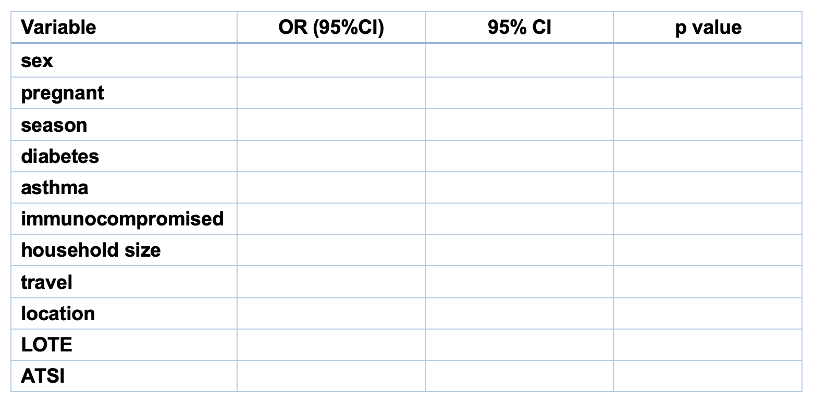

```{r setup, include=FALSE}
knitr::opts_chunk$set(echo = TRUE)
```

***
### Learning objectives

By the end of this session, participants will have the skills and ability to:

+ Understand the basics of logistic regression
+ Perform a simple multivariable analysis in R
+ Check the fit of a logistic regression model
+ Interpret results of logistic regression analysis

***


This data analysis exercise was designed by Martyn Kirk MAppEpid PhD and Katie Glass PhD, National Centre for Epidemiology and Population Health in August 2014. This case study on logistic regression uses the following resources:

+	utri.csv

Packages required:

+ [epitools](https://cran.r-project.org/web/packages/epitools/index.html)
+ [MASS](https://cran.r-project.org/web/packages/MASS/index.html)
+ [lmtest](https://cran.r-project.org/web/packages/lmtest/index.html)
+ [margins](https://cran.r-project.org/web/packages/margins/index.html)
+ [ResourceSelection](https://cran.r-project.org/web/packages/ResourceSelection/index.html)
+ [pROC](https://cran.r-project.org/web/packages/pROC/index.html)


This practical exercise is based on the following textbooks:

*Jewell N. Statistics for Epidemiology. 2004. Chapman & Hall/CRC, New York.*

*Schlesselman JJ. Case-Control Studies Design, Conduct, Analysis. 1982. Oxford University Press, New York.*

*Hosmer DW, Lemeshow S & Sturdivant RX. Applied Logistic Regression. Third Edition. 2013 John Wiley and Sons, New York.*

*Hilbe JM. Logistic Regression Models. 2009 Chapman & Hall/CRC, Boca Raton.*


``` {r, include=FALSE}
if (!require(epitools)) {
    install.packages("epitools")
    require(epitools)
}
if (!require(MASS)) {
    install.packages("MASS")
    require(MASS)
}
if (!require(lmtest)) {
    install.packages("lmtest")
    require(lmtest)
}
if (!require(margins)) {
    install.packages("margins")
    require(margins)
}
if (!require(ResourceSelection)) {
    install.packages("ResourceSelection")
    require(ResourceSelection)
}
if (!require(pROC)) {
    install.packages("pROC")
    require(pROC)
}

# install.packages("epitools") 
# install.packages("MASS") 
# install.packages("lmtest") 
# install.packages("margins")
# install.packages("ResourceSelection")
# install.packages("pROC")
```


## 1. Introduction 

The goal of a logistic regression model is to understand the relationship between a binary (dependent) outcome and one or more other predictors. Logistic models are widely used in health and medical data analyses. There are two major uses of these models: to identify risk factors for an event using odds ratios and to understand the predictive probability of an event occurring.

In logistic regression models, the binary outcome is often coded 0 or 1, with 0 indicating failure and 1 success or occurrence of an event. Depending on the statistical procedure, different statistical packages will require binary outcomes to be coded differently, but for R, we will use 0/1.

There are two main commands we will be using in this exercise: the logit and logistic commands. We could also use the generalized linear model (GLM ^[The Generalized Linear Model (GLM) is a generalization of linear regression that allows outcomes that are not normally distributed. These models allow the linear model to be related to the outcome via a link function and by allowing variance of measurements to be a function of their predicted value]) with the logit link function. In this session, we are not going to emphasize the derivation of the logistic model, but will focus on more practical issues relating to construction of a multivariable model and interpretation of results.

In this exercise, we are going to analyze a cross-sectional survey for risk factors for acute respiratory infection in Australia. This analysis will allow us to construct some simple logistic models, and explore strategies for analysis. 


## 2. Checking your data
### 2.1 About the study

The National Gastroenteritis Survey II (NGSII) was a nationwide cross-sectional survey examining the prevalence of gastroenteritis and other common illnesses. The survey was conducted for the Department of Health & Ageing and New South Wales Food Authority. The main purpose of the survey was to estimate the incidence of gastroenteritis. The survey was run over a 12-month period in 2008-9. Sampling was stratified by State and Territory to obtain similar size samples by jurisdiction. 

During the survey, respondents were asked if they had experienced ‘cold or flu’ in the previous four weeks. The survey question read: 

*“I would like to talk now about any colds or flu that you had in the last 4 weeks. In the past 4 weeks, have you had the cold or flu? We call the cold or flu being sick with runny nose, sore throat, fever or cough."*

We are going to examine Acute Respiratory Infection (ARI) according to a case definition published by Leder et al. (2003) ^[Leder K, Sinclair MI, Mitakakis TZ, Hellard ME, Forbes A. A community-based study of respiratory episodes in Melbourne, Australia. Aust N Z J Public Health 2003; 27:399-404].  A case of ARI was defined as any episode of cold or flu, with at least one of the following symptoms: fever, chills, sore throat, runny nose, or cough in the past four weeks.


### 2.2 Objectives

The objectives of the analysis in this session are to determine:

+ Are people with chronic diseases at higher risk of ARI?
+	What are the main risk factors for ARI in Australia?

**Task 1: (10 minutes)** Open up the dataset “utri.csv” and inspect the datafile. The dataset has 19 variables, some of which we will not be examining today (month-absagesex_cat). Make sure you have set up your working directory, and prepared the R script.

Below, you will see the data dictionary for utri.csv (table 1). The dataset is pretty clean, with most variables in numeric format. We may need to recode some variables as we go along. 


**What is your outcome variable for this analysis? Perform some simple cross tabulations with variables describing age and sex. Write down your conclusions from these analyses, including the distribution of different groups in the survey.**

Start with: 

```{r }
utri <- read.csv("utri.csv")
```


    The main outcome variable in this analysis is Acute Respiratory Infections (ARI). Cross tabulation with key variables age & sex reveal that:
    1.	females and older people appear to be over-represented in the survey,
    2.	the proportion of males and females reporting ARI was similar at 20%
    3.	younger children under 5 years of age were most likely to experience ARI
    4.	older people were least likely to report ARI
    5.	the proportion of people reporting ARI by age group was significantly different.


Table: Table 1. Data dictionary for utri.csv data

 |Variable name	 |Explanation	   |Data format               |
 | :------------ | :-----------: | -------------------: |
 |id	           |Unique identification number|         	Numeric|
| ARI	| Acute Respiratory Infection in past 4 weeks	|Numeric: 0,1|
|age_cat	|Age group of study subject|	Numeric: 0, 5, 10, …65+ |
|sex	|Sex of study subject	|Numeric: 0,1|
|pregnant	|Study subject was pregnant	|Numeric: 0,1|
|season|	Season person was interviewed	|Numeric: 1-4|
|diabetes	|Study subject had diabetes	|Numeric: 0,1|
|asthma	|Study subject had asthma	|Numeric: 0, 1|
|immunocompromised	|Study subject was immunocompromised|	Numeric: 0, 1|
|household_size	|Number of people living in house|	Numeric|
|travel 	|Study subject travelled prior to illness	|Numeric: 0, 1|
|location	|Location of home|	Numeric: 1-4|
|LOTE	|Language other than English spoken at home|	Numeric: 0, 1|
|ATSI	|Study subject is Aboriginal/Torres Strait Islander	|Numeric: 0, 1|
|state_r	|State of residence|	Numeric:1-7|
|month|	Month of interview|	Numeric: 1-12|
|stweight	|Inverse probability of selection in State or Territory	|Numeric|
|agesex_cat	|Age sex category by State|	Numeric|
|absagesex_cat	|Populations in age-sex category in State|	Numeric|


## 3.	Univariable analysis
###3.1	Introduction

It is time to revisit the odds ratio.

We are going to look first to see whether the presence of chronic diseases increased the odds of reporting ARI. There are some chronic diseases that we might expect to modify the risk of ARI due to medication use, physiological susceptibility, or suppression of immunity.

**Task 2: (5 minutes)** 

a) In the command window type the following command:
``` {r}
OR_dia_ari <- table(utri$diabetes, utri$ARI)
```

b) Fill in the two-by-two table below putting the data in the respective cells

```{r, out.width = "500px", echo=FALSE}

```


c) Calculate the odds ratio given by ad/bc. 

Step by step calculation:

```{r }
# Manual
a<- 5097 # exposed with disease
b <- 1290 # exposed with no disease
c <-439 # non-exposed with disease
d <- 84 # non-exposed with no disease

exposed <- a/b
unexposed <- c/d

OR_disease <- exposed/unexposed

```

Using the package `epitools` (install package first before R can utilise it from the library), which can also calculate the 95% confidence intervals:

``` {r,eval=FALSE}

# if you want to use a package that will do this for you, load the epitools package. 
library(epitools)
oddsratio(OR_dia_ari, method ="wald")

```

d)	Now subject the same variables to a logistic regression, by using the package `MASS` (install package first)

```{r, eval=FALSE}
# Step 1: 
library(MASS)

# Step 2: 
a <- glm(utri$ARI~ utri$diabetes, family = binomial(link = logit))

# Step 3: 
summary(a)

# Step 4: 
exp(cbind("Odds ratio" = coef(a), confint.default(a, level = 0.95)))


```

In this instance where we have only one independent variable, the equation looks like:

$$\hat{g}{(x)}=log\frac{p}{(1-p)}=\beta_0+\beta_1x_1$$

We need to exponentiate the results to provide us with an odds ratio for the association between ARI and diabetes. As you can see, the odds ratio was identical to that which we calculated by hand.

**Task 3:**  Is diabetes associated with ARI? What about asthma?

    From the univariate analysis, people with diabetes have a lower odds of ARI than people without, which is p < 0.05. For asthma, people with ARI had a higher odds than people without asthma. 


For many infections, we would expect age and sex to be risk factors. In the dataset, age and sex are categorical variables. We want to explore the odds ratio for sex and different age groups with ARI. It is important to understand what type of data is contained in each variable. If it is binary (Yes/No, Present/Absent) then it is relatively simple to include in a logistic regression. If it is categorical with multiple levels, it is important to use ‘dummy variables’ set to 1 for each level, with 0 for comparison. It may also be best to collapse categories depending on the distribution of data across the variable.

**Task 4: (5 minutes)** Type the following commands:
```{r, eval=FALSE}

table(utri$sex, utri$ARI)

a1 <- glm(utri$ARI~ utri$sex, family = binomial(link = 'logit')); 
exp(cbind("Odds ratio" = coef(a1), confint.default(a1, level = 0.95)))
table (utri$age_cat, utri$ARI)
a2 <- glm(utri$ARI~ utri$age_cat, family = binomial(link = 'logit')); 
exp(cbind("Odds ratio" = coef(a2), confint.default(a2, level = 0.95)))
```


We can see from the tabulation of ARI and age_cat that there are 9 levels of this variable and that they are not equally distributed, ie – some intervals cover 5 years while others include ten years or more. Unlike Stata, R considers age_cat as a categorical variable without the need to specifying separately. 

**What can we say about the association between age group and ARI from this analysis? What about sex as a risk factor?**

    All age groups have a lower odds of ARI than 0–4 year old children. The odds ratio decreases relatively uniformly with the lowest risk in people 65 years or older. Age appears to be a strong risk factor for ARI and definitely should be included in future analyses. Males were equally likely to report ARI in the previous month compared to females and sex does not appear to be associated with infection.


###3.2	Further analyses
Now we are going to conduct logistic regressions of the remaining variables in the dataset. We will do it in a similar fashion to what we did for diabetes above. It is important to look at the raw data for each of these variables, so we are going to cross-tabulate them with ARI as well. The easiest way to do this is using a foreach loop. 

**Task 5: (10 minutes)** In the R script, type the following commands:

```{r,eval=FALSE}
vars <- list(utri$sex, utri$season)
 for (var in vars){
      x1 <- glm(utri$ARI~ var, family = binomial(link = 'logit'),    na.action = na.exclude, data = utri)
      exp <- exp(cbind("Odds ratio" = coef(x1), confint.default(x1, level = 0.95)))
      print(exp)
 }
```


Review the results of these analyses and fill in the following table using univariable logistic regression of ARI with potential risk factors:

```{r, out.width = "700px", echo=FALSE}

```

Before we go any further, there are a couple of variables here that we should examine a bit more closely. Two that had multiple levels were season and location. We should see how best to include these in any multivariable model. 

**Task 6: (5 minutes)** In the R script type the following commands:
```{r, eval=FALSE}
table(utri$season, utri$ARI) 

# The GLM model 
x2 <- glm(utri$ARI~ utri$season, family = binomial(link = 'logit')) 

# To obtain the odds ratios: 
exp(cbind("Odds ratio" = coef(x2), confint.default(x2, level = 0.95)))
table(utri$location, utri$ARI)

# The GLM model 
x3 <- glm(utri$ARI~ utri$location, family = binomial(link = 'logit')) 

# To obtain the odds ratios: 
exp(cbind("Odds ratio" = coef(x3), confint.default(x3, level = 0.95)))
```


**What do you think about the odds ratios for these variables? What should we do with these when we proceed to including multiple variables in the model?**

    The odds ratios are not consistent at different levels of these variables. In particular, winter had a markedly stronger association with ARI than the reference category, which was autumn. We should include this variable as indicator variables in future models. For location, the only level that was significantly associated with ARI compared with the baseline of capital/major city, which was for a rural area. Remote areas had very few study subjects. Here we should create one variable for rural/remote compared to urban and see if that is worth including in future models.


**Task 7: (5 minutes)** In the R script, create a new variable called ‘rural’:
```{r,eval=FALSE}

# 1 = "yes". i.e. "if location column states "Rural" or "Remote", then rural column entries will correspond to 1 (Yes), 0 = "no", i.e. if location column contains anything else, then rural column will correspond to 'no'

utri$rural <- ifelse(utri$location =="Rural" | utri$location =="Remote", 1,0) # creating the new variable "rural"

utri$rural <- factor(utri$rural, levels = c(0,1), labels = c("No", "Yes")) # this is where the yes/no labels are defined

table(utri$ARI,utri$rural)

# GLM model:
	x4 <- glm(utri$ARI~ utri$rural, family = binomial(link = 'logit')) 
	exp(cbind("Odds ratio" = coef(x4), confint.default(x4, level = 0.95)))
```


## 4.	Multivariable analysis

There are several strategies for building multivariable models, including purposeful selection of covariates, stepwise methods and choosing subset models. Different strategies may be employed in different disciplines.

In this exercise, we are going to purposefully select covariates for inclusion in our logistic regression model. This involves the following steps:

1.	Careful univariable analysis to identify candidates, with p>0.25 as a screening level, for multivariable analysis.

2.	Fit the multivariable model using variables decided at step 1. Following this, assess the importance of each variable using p values at traditional levels of significance. Drop variable from the model that do not meet p value cut-offs.

3.	Compare the reduced model to the original model using a likelihood ratio test and assess the change in coefficients.

4.	Check for interactions in the main effects model.

5.	Check the adequacy and fit of the model.

6.	Interpret the results of the model

**Task 8: (5 minutes)** In the command line type commands for a logistic model, including all variables p<0.25 in univariable analysis, along with sex that might be expected to vary with age_cat:

``` {r,eval=FALSE}

glm(ARI ~ sex + age_cat + season + asthma +immunocompromised+ household_size + diabetes + travel + rural + LOTE + ATSI,  family = binomial(link = 'logit'), data = utri)


```

**Review the output of the logistic model. What variables should we remove from the model?**

    In the logistic model, there are several variables with p<0.05, including age_cat, sex, season, asthma, immunocompromised, household size, and rural. Interestingly, sex is now significant when included with age_cat, which may indicate that the association varies across age categories. These variables should be retained in the model and diabetes, travel, LOTE and ATSI removed.


**Task 9: (10 minutes)** Run the full model and the reduced model, as we will compare them using a likelihood ratio test (you will need the `lmtest` package for this). To do this we will store the estimates from the first model and compare them to the second. In the command line type:

```{r,eval=FALSE}
fm1 <- glm(ARI ~ sex + age_cat + season + asthma + immunocompromised+ household_size + diabetes + travel + LOTE + ATSI, family = binomial(link = 'logit'), data = utri)

fm2 <- glm(ARI ~ sex + age_cat + season + asthma + immunocompromised+ household_size, family = binomial(link = 'logit'),data = utri)

library(lmtest)
lrtest(fm1, fm2)

```

From this we can see that the Chi square test is p>0.05, which indicates that the variables we have removed did not significantly contribute to the understanding of the risk of ARI. Once we are comfortable that this reduced model contains all the necessary variables, we would call it our ‘main effects model’.

##5	Assessing Interactions 

Assessing interactions is a complex topic, as it involves assessing variation of effect in one variable across another. When the odds ratio for one variable is not constant over the levels of another, the two variables are said to have a statistical interaction. In this session, we are going to examine the potential interactions between two variables age_cat and sex. We might expect that the risk of ARI might vary across age groups by sex, particularly in females of childbearing age given the high prevalence of ARI in children.

**Task 10: (10 minutes):** We will run a simple logistic regression model that includes an interaction term where sex and age are combined. The package `margins` is an effort to port Stata’s (closed source) margins command to R as an S3 generic method for calculating the marginal effects (or “partial effects”) of covariates included in model objects (like those of classes “lm” and “glm”).

```{r,eval=FALSE}
fm3 <- glm(ARI~ sex*age_cat, family = binomial(link = 'logit'), data = utri)

library(margins)

summary(margins(fm3)) # this allows you to obtain outputs that look similar to STATA

margins(fm3) # calculates the average marginal effects

pred <- predict(fm3) # to obtain predicted values of ARI from model fm3

prob <- exp(pred)/(1+exp(pred)) # to calculate probability of ARI =1

interaction.plot(utri$age_cat, utri$sex, prob) # to generate interaction plots
```

When examining for interaction, we should interpret results as if it was a stratified analysis. We are looking to examine risks of sub-categories by combinations of variables. In a moderately large dataset like this one examining ARI, we are able to stratify over many levels of a variable, such as age_cat that has 18 levels when combined with sex.


In the end we will conclude that the variable is either:

1.	neither a confounder or effect modifier, 
2.	a confounder, where there is evidence of statistical adjustment, but not interaction, or
3.	an effect modifier where there is evidence of statistical interaction, or
4.	both a confounder and an effect modifier.

While we can see there is a difference in the predicted probabilities of ARI by sex, there is no difference in the slope of the two lines. The confidence intervals overlap for the predicted probabilities, so we would conclude that there is not a significant difference, or any significant interaction between age and sex for ARI. We could also use lrtest to compare the model with and without the interaction term.


## 6.	Testing Model Fit 

There are many different ways assessing whether a model fits the data adequately. The term ‘goodness of fit’ really means whether the probabilities produced by the model accurately reflect the data. To finish of the session, we will do two things: calculate some summary test statistics (using the `ResourceSelection` package) and examine how well the model classifies the data (using the `pROC` package for visualisation).

The Hosmer-Lemeshow goodness of fit test is one of the best ways of assessing the fit of logistic models. The Hosmer and Lemeshow goodness-of-fit test assesses predicted frequency and those observed in the data. A large p value for the Hosmer and Lemeshow test indicates a well-fitting model.


**Task 11: (10 minutes):** Run the main effects model again and follow it up with some post-estimation commands. In the command line type:

```{r,eval=FALSE}
# a. 
fm4 <- glm(ARI ~ sex + age_cat + season + asthma +immunocompromised+ household_size, family = binomial(link = 'logit'), data = utri)

# b. 
library(ResourceSelection)
hoslem.test(utri$ARI, fitted(fm4), g =10)

# c. to plot ROC curve
prob=predict(fm4,type=c("response"))
fm4$prob=prob
library(pROC) # allows you to visualise the ROC curve
g <- roc(utri$ARI ~ prob)
plot(g)  

# d. to calculate AUC (area under the curve)
auc(g)
```


The 10 groups are often referred to as ‘deciles of risk’ for the outcome, which in this case is ARI. The columns show the number of observed cases of ARI or not from the data versus the expected number from the main effects model. Ideally, there would be good agreement between the two columns. In addition, the probability of the summary measure of the Hosmer-Lemeshow Chi-square test >0.05 indicating a good model fit.

The pROC package produces a ‘Receiver Operator Curve’ and calculates the area under the curve. The ROC curve plots the true signal (sensitivity) against a false signal (1-specificity). It is a standard way of assessing how well a fitted model assigns higher probabilities to people who develop the outcome, in this case ARI. The area under the curve ranges from 0.5 to 1.0. If the model did not predict ARI very well then a plot of sensitivity versus 1-specificity would be a straight line and the area under the curve=0.5 and we might as well flip a coin. The following rules of thumb are used for the area under a ROC curve:

+	<0.6—No or poor discrimination
+	0.7-0.8—Acceptable discrimination
+ 0.8-0.9—Excellent discrimination
+	>0.9—Outstanding discrimination


**Discuss the results of the goodness of fit tests. What do you think of the performance of the main effects model now?**

    The Hosmer Lemeshow test indicates that the model is a good fit for the observed data. In terms of accurately classifying study subjects, the model did OK. The area under the ROC curve was 0.7, which indicates a reasonable fit to the data. In general, the model fits the data reasonably well.


## 7.	Summary

Now the only thing left to do is to interpret your analysis. Then you should clear your data, close your logs and document your do file to turn it into a do file that makes sense. Make sure you put explanatory text so you will know what you were thinking during this session.

Well done!!! We hope you feel comfortable performing logistic regression analyses and constructing a simple multivariable model after completing this exercise.
